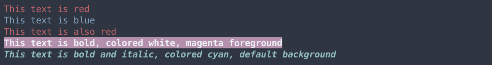

# Pintor
[](https://pkg.go.dev/github.com/jbaxx/pintor)

Pintor is a small package to colorize text output in your Command Line applications.
Pintor applies ANSI escape sequences to modify text.

## Installation

1. Install Pintor

```sh
$ go get -u github.com/jbaxx/pintor
```

2. Import it in your code

```sh
import "github.com/jbaxx/pintor"
```

## Quick start
Start by creating a formatter object passing the foreground and background colors, and modifiers as parameters.
Then apply the format to a string, which will be properly ANSI escaped to print using the desired colors and modifiers.

```go
package main

import (
	"fmt"

	"github.com/jbaxx/pintor"
)

func main() {
	red := pintor.NewFormatter(pintor.Red, 0, 0)
	textColoredRed := red.Format("This text is red")
	fmt.Println(textColoredRed)

	blue := pintor.NewFormatter(pintor.Blue, 0, 0)
	fmt.Println(blue.Format("This text is blue"))

	fmt.Println(red.Format("This text is also red"))

	whiteMagentaB := pintor.NewFormatter(pintor.White, pintor.Magenta, pintor.Bold)
	fmt.Println(
		whiteMagentaB.Format("This text is bold, colored white, magenta foreground"),
	)

	cyanBI := pintor.NewFormatter(pintor.Cyan, pintor.Default, pintor.Bold|pintor.Italic)
	fmt.Println(
		cyanBI.Format("This text is bold and italic, colored cyan, default background"),
	)

}
```

Will provide output similar to this



### Demo
You can run a small demo that displays foreground, background and modifiers combinations, by executing at the root of the repository:

```sh
go run examples/main.go
```
